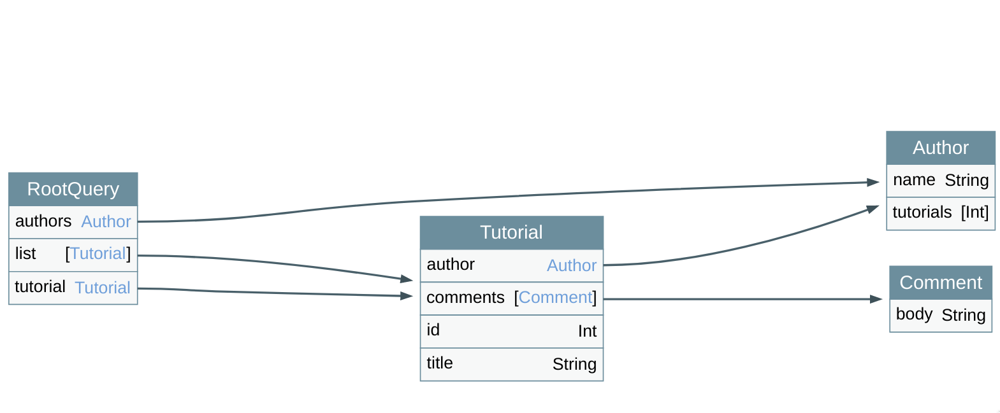

# go-voyager-graphql

[](https://github.com/kiran94/graphql-voyager-go/actions/workflows/main.yml)

go-voyager-graphql is a small package that allows you to serve the [graphql-voyager](https://github.com/IvanGoncharov/graphql-voyager) graph from a HTTP Server.



## Usage 

```go
// Create a new Handler, pass in your GraphQL Endpoint
vh := voyager.NewVoyagerHandler("/graphql")

// Register the Handler
http.Handle("/voyager", vh)
```

Complete Sample can be found in [cmd/server/main.go](./cmd/server/main.go)

## Local Setup 

Assuming you are at the root of the repo.

```bash
make install_tools
make build
make test

# Run the Server 
# Navigate to http://localhost:8080/voyager
make run_server
```
